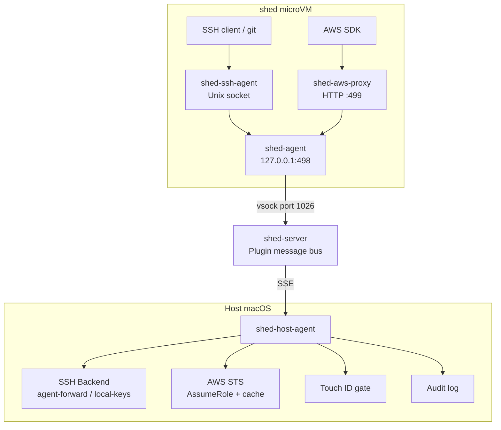
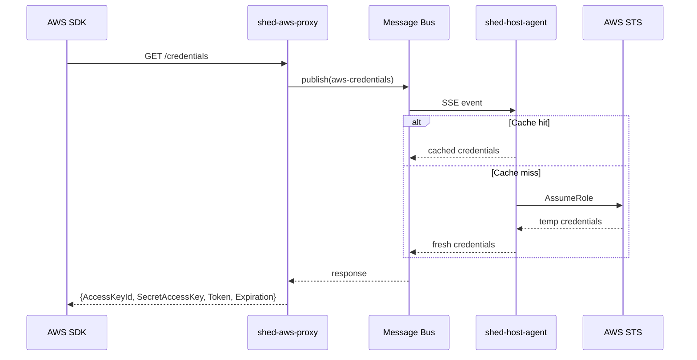
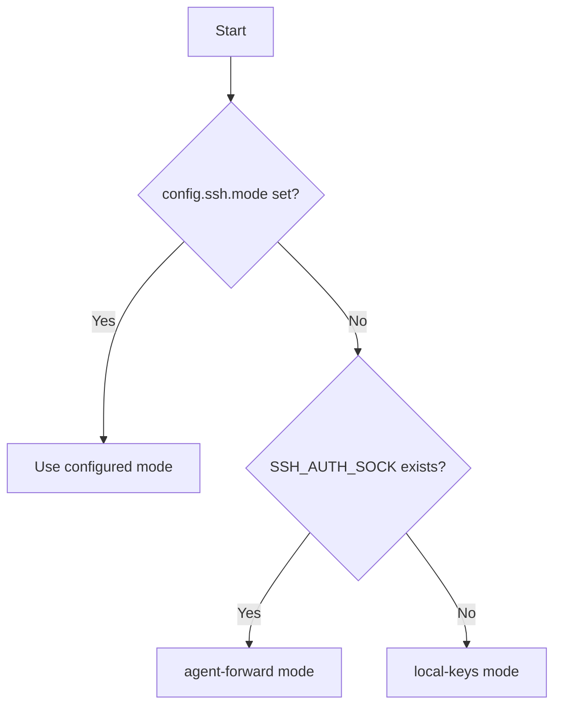

# Architecture

## Component Overview

## Message Flow

### SSH Sign Request

1. SSH client connects to `shed-ssh-agent` via `SSH_AUTH_SOCK`
2. `shed-ssh-agent` translates the SSH agent protocol `Sign()` call into a JSON envelope
3. Envelope is POSTed to `http://127.0.0.1:498/v1/publish` (shed-agent's HTTP endpoint)
4. shed-agent sends the message over vsock to shed-server
5. shed-server routes the message to the `ssh-agent` namespace listener via SSE
6. `shed-host-agent` receives the envelope, dispatches to the SSH backend
7. SSH backend performs the signing operation using host keys
8. Response envelope flows back: host-agent -> shed-server -> shed-agent -> shed-ssh-agent
9. `shed-ssh-agent` returns the signature to the SSH client

### AWS Credential Request

1. AWS SDK calls `GET http://127.0.0.1:499/credentials` (via `AWS_CONTAINER_CREDENTIALS_FULL_URI`)
2. `shed-aws-proxy` translates the HTTP request into a JSON envelope
3. Envelope is POSTed to the shed-agent publish endpoint
4. shed-server routes the message to the `aws-credentials` namespace listener via SSE
5. `shed-host-agent` receives the envelope, checks its credential cache
6. If cached credentials are still valid (>5 min remaining), return immediately
7. If stale, call `sts:AssumeRole` with the configured role, cache result
8. Response flows back to `shed-aws-proxy`, which returns the AWS SDK-expected format
9. The SDK caches the credential in memory and manages its own refresh

## Package Structure

### Guest-Side

- **`internal/sshagent/`** — Implements `golang.org/x/crypto/ssh/agent.Agent`. Each method marshals a request, POSTs to the publish endpoint, and unmarshals the response.
- **`internal/awsproxy/`** — HTTP handler for the AWS container credential endpoint. Translates `GET /credentials` into message bus requests. Returns the PascalCase JSON format the AWS SDK expects.
- **`cmd/shed-ssh-agent/`** — Unix socket listener. Creates a new agent instance per connection. Handles startup health check and graceful shutdown.
- **`cmd/shed-aws-proxy/`** — HTTP server on port 499. Routes `/credentials` to the proxy handler.

### Host-Side

- **`internal/hostclient/`** — SSE client for shed-server's plugin API. Handles subscription, reconnection, and response delivery.
- **`cmd/shed-host-agent/`** — Main binary. Loads config, initializes backends, subscribes to namespaces, dispatches requests to handlers. Runs SSH and AWS handlers concurrently.

### Shared

- **`internal/protocol/`** — Envelope and payload types. Defined locally (not imported from shed) to avoid dependency coupling. JSON wire format matches shed's `internal/plugin` types.

## SSH Backend Selection

**Agent-forward**: Proxies to the developer's existing SSH agent (Secretive, 1Password, ssh-agent, yubikey-agent). Zero disruption to existing key management.

**Local-keys**: Reads keys directly from `~/.ssh/`. Fallback when no agent is running.

## AWS Credential Caching

The caching strategy is asymmetric:

- **Guest proxy**: Pure passthrough, no caching. Every SDK request goes to the bus.
- **Host handler**: Caches STS credentials per shed, keyed by shed name.

This avoids cache coherence complexity. The bus round trip is sub-millisecond (vsock, same machine), and the SDK only fetches credentials when its in-memory cache is stale (~once per hour).

## Security Boundaries

| Boundary | What crosses | What doesn't |
|----------|-------------|--------------|
| VM -> Host (SSH sign) | Challenge data, public key reference | Private keys |
| Host -> VM (SSH response) | Signature blob | Private keys |
| VM -> Host (AWS request) | Operation type only | Role ARN, source credentials |
| Host -> VM (AWS response) | Short-lived STS token (1h) | Long-lived AWS credentials |
