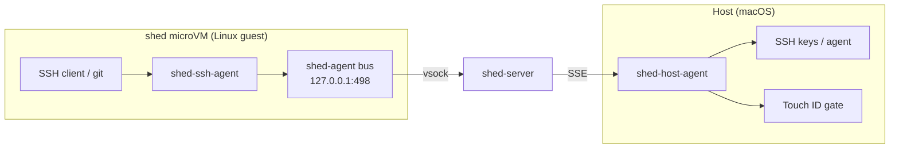

# shed-extensions

Secure credential brokering for shed microVM development environments.

## What it does

shed-extensions keeps credentials off your VMs. SSH keys never leave your Mac. AWS secrets never enter the guest. All signing and credential resolution happens on the host, mediated by shed's plugin message bus.

Standard tools work without changes — `git push`, AWS SDKs, `ssh` — all transparently proxied through the credential broker.

## Architecture

## Credential Namespaces

| Namespace | Status | Description |
|-----------|--------|-------------|
| `ssh-agent` | Phase 1 | SSH key operations for git, SCP, remote access |
| `aws-credentials` | Phase 2 | AWS SDK credential vending via STS role assumption |

## Security Properties

- SSH private keys never enter the VM — only signatures cross the bus
- AWS long-lived credentials never leave the host
- AWS STS session tokens are short-lived and role-scoped
- Optional Touch ID approval gate for sign operations
- All operations logged to host-side audit log

## Quick Start

See [Getting Started](getting-started/quick-start.md) for setup instructions.
