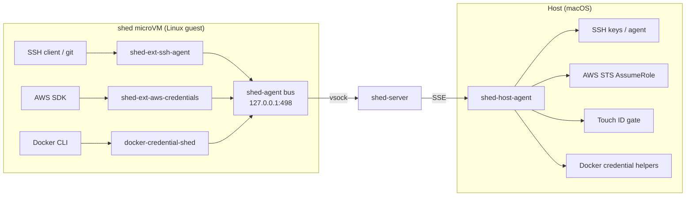

# shed-extensions

Secure credential brokering for shed microVM development environments.

## What it does

shed-extensions keeps credentials off your VMs. SSH keys never leave your Mac. AWS secrets never enter the guest. Docker registry credentials are resolved on the host. All signing and credential resolution happens on the host, mediated by shed's plugin message bus.

Standard tools work without changes — `git push`, AWS SDKs, `ssh`, `docker pull` — all transparently proxied through the credential broker.

## Architecture

## Credential Namespaces

| Namespace | Status | Description |
|-----------|--------|-------------|
| `ssh-agent` | Implemented | SSH key operations for git, SCP, remote access |
| `aws-credentials` | Implemented | AWS SDK credential vending via STS role assumption |
| `docker-credentials` | Implemented | Docker registry credential brokering for container pulls |

## Security Properties

- SSH private keys never enter the VM — only signatures cross the bus
- AWS long-lived credentials never leave the host
- AWS STS session tokens are short-lived (1 hour) and role-scoped
- Docker registry credentials brokered on demand from host credential helpers
- Optional Touch ID approval gate for sign operations
- All operations logged to host-side audit log

## Image Distribution

Guest components (`shed-ext-ssh-agent`, `shed-ext-aws-credentials`, `docker-credential-shed`) are pre-installed in shed's [`experimental` image variant](https://charliek.github.io/shed/reference/images/). Create a shed with `--image experimental` to get credential brokering out of the box.

The host component (`shed-host-agent`) is installed separately — see [Getting Started](getting-started/quick-start.md) for setup instructions.
