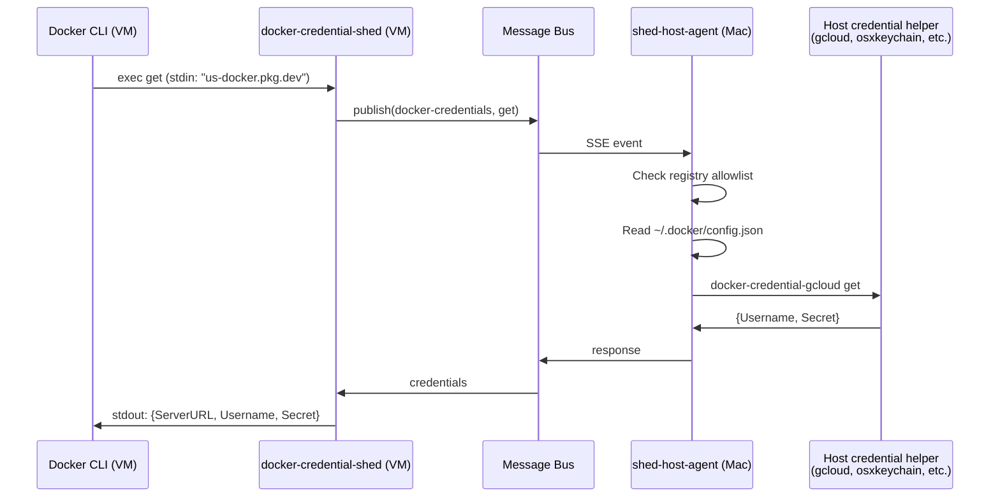

# Docker Credentials

The `docker-credentials` namespace brokers Docker registry credentials between shed microVMs and the host machine. Registry passwords and tokens are resolved on the host using the developer's existing Docker credential helpers (gcloud, osxkeychain, ecr-login, etc.).

## How It Works

`docker-credential-shed` is installed inside the VM at `/usr/local/bin/`. Docker discovers it via the `credsStore` setting in `~/.docker/config.json`. Unlike the SSH and AWS extensions, this is a **one-shot binary** — Docker execs it on demand, not a long-running daemon.

When Docker needs credentials for a registry pull or push, it runs `docker-credential-shed get` with the registry hostname on stdin. The binary sends the request through the message bus to the host agent, which resolves credentials from the host's Docker credential store.



## Docker Integration

The guest VM's `~/.docker/config.json` is configured with:

```json
{
  "credsStore": "shed"
}
```

This tells Docker to use `docker-credential-shed` as the default credential helper for all registries. The host-side allowlist controls which registries actually get credentials served.

## Registry Configuration

The host agent controls which registries are available to VMs via an allowlist:

```yaml
docker:
  registries:
    - us-docker.pkg.dev
    - ghcr.io
    - artifactory.corp.com
```

Or allow all registries:

```yaml
docker:
  allow_all: true
```

If no registries are configured and `allow_all` is false (the default), the handler starts but rejects all credential requests with a clear error.

## Supported Credential Sources

The host agent reads `~/.docker/config.json` (or `$DOCKER_CONFIG/config.json`) and resolves credentials in priority order:

| Source | Config key | Example | How it works |
|--------|-----------|---------|-------------|
| Per-registry helper | `credHelpers` | `"us-docker.pkg.dev": "gcloud"` | Execs `docker-credential-gcloud get` |
| Default helper | `credsStore` | `"credsStore": "osxkeychain"` | Execs `docker-credential-osxkeychain get` |
| Inline credentials | `auths` | `"auths": {"registry.io": {"auth": "..."}}` | Decodes base64 `user:pass` |

## Message Format

### Get Request

```json
{
  "id": "0192b3a5-...",
  "namespace": "docker-credentials",
  "type": "request",
  "payload": {
    "operation": "get",
    "server_url": "us-docker.pkg.dev"
  }
}
```

### Get Response

```json
{
  "id": "0192b3a5-...",
  "namespace": "docker-credentials",
  "type": "response",
  "payload": {
    "server_url": "us-docker.pkg.dev",
    "username": "_json_key",
    "secret": "ya29.a0AfH6SM..."
  }
}
```

### Error

```json
{
  "id": "0192b3a5-...",
  "namespace": "docker-credentials",
  "type": "response",
  "payload": {
    "error": "registry \"blocked.io\" not in allowlist",
    "code": "REGISTRY_NOT_ALLOWED"
  }
}
```

Error codes: `CREDENTIALS_NOT_FOUND`, `REGISTRY_NOT_ALLOWED`, `READ_ONLY`, `HELPER_FAILED`, `INTERNAL_ERROR`.

## Read-Only Broker

`docker-credential-shed` rejects `store` and `erase` operations with an error. Credential management happens on the host only — the VM cannot modify the host's Docker credential store.

## Credential Caching

No caching on either side. Each `docker pull` triggers a fresh credential lookup on the host. Docker credential helpers are fast local calls (gcloud reads from its local cache, osxkeychain reads from keychain), and Docker typically calls `get` once per registry per operation.

## Timeouts

Credential requests use a 5-second timeout. On timeout, the binary writes an error to stderr and exits with code 1. Docker then falls back to anonymous access or prompts for credentials depending on the registry.
